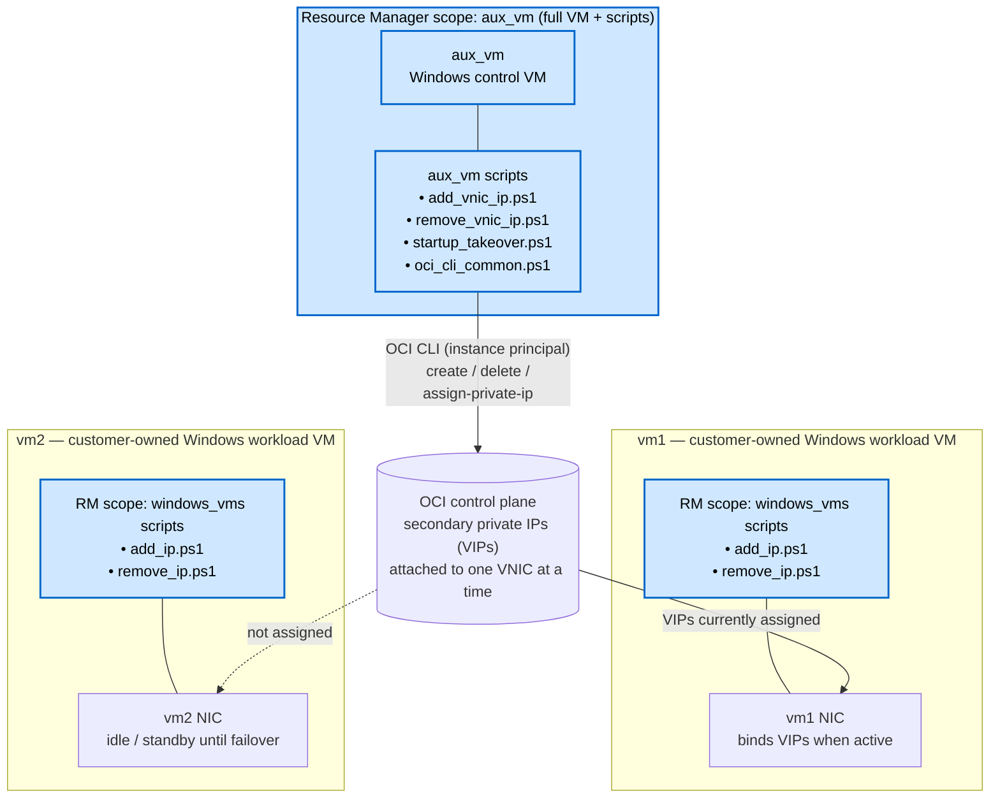

# OCI VIP Failover for Windows

PowerShell-first tooling for moving Oracle Cloud Infrastructure (OCI) **secondary
private IPs** (VIPs) between Windows VMs, and binding those VIPs to the local
Windows NIC so applications on the active VM can serve traffic on them.

The repository ships three things:

1. A **Terraform / OCI Resource Manager (ORM) stack** that builds the Windows VM
   and bootstraps it.
2. **`aux_vm`** PowerShell scripts that talk to OCI APIs (via the OCI CLI) to
   create, delete, list, and move the OCI private-IP resources.
3. **`windows_vms`** PowerShell scripts that only configure the local Windows
   network stack (no OCI calls).

---

## Sample architecture



**Resource Manager scope** (shaded blue in the diagram):

- **`aux_vm`** — the full Windows VM **and** the `aux_vm\*.ps1` scripts staged
  on it. This is the only place that talks to OCI APIs.
- **`vm1`, `vm2`** — ORM delivers **only** the `windows_vms\*.ps1` scripts.
  The workload VMs themselves are the customer's existing Windows servers and
  only ever touch their own NIC.

Exactly one of `vm1` / `vm2` owns the VIPs at any moment. Failover is a move
of the OCI private-IP resources from one VNIC to the other, followed by an
OS-level bind on the new owner.

---

## Table of Contents

- [How it works (concept)](#how-it-works-concept)
- [Deploy with OCI Resource Manager](#deploy-with-oci-resource-manager)
- [What the Resource Manager stack delivers](#what-the-resource-manager-stack-delivers)
- [Repository layout](#repository-layout)
- [VM-local configuration (`vip_config.json`)](#vm-local-configuration-vip_configjson)
- [`aux_vm` scripts (OCI side)](#aux_vm-scripts-oci-side)
- [`windows_vms` scripts (OS side)](#windows_vms-scripts-os-side)
- [End-to-end logical flow](#end-to-end-logical-flow)
- [OCI CLI authentication](#oci-cli-authentication)
- [Terraform notes](#terraform-notes)

---

## How it works (concept)

A **VIP** in this project is just an OCI **secondary private IP** that lives on
a VNIC. OCI lets you reassign a secondary private IP from one VNIC to another
in a single API call (`assign-private-ip --unassign-if-already-assigned`).
Failover therefore has two halves:

| Half | Where it happens | Done by |
| --- | --- | --- |
| Move the IP **resource** to the new VM's VNIC | OCI control plane | `aux_vm` scripts (OCI CLI) |
| Bind the IP to the **OS NIC** so Windows answers ARP/traffic | Inside Windows | `windows_vms` scripts |

`startup_takeover.ps1` performs only the OCI control-plane move. After it
finishes, run `windows_vms\add_ip.ps1` locally on the Windows VM that now owns
the VIPs so the OS NIC starts answering for them.

---

## Deploy with OCI Resource Manager

[](https://cloud.oracle.com/resourcemanager/stacks/create?region=home&zipUrl=https://github.com/aszynkow/oci_vip_failover/raw/main/release/0.0.2/rm_vip.zip)

1. Click **Deploy to Oracle Cloud** above.
2. In **Create Stack**, fill in:
   - A stack name, for example `vip-failover-windows-vm`.
   - The target compartment for the Windows VIP VM.
   - The existing **VCN**, **subnet**, and **availability domain**.
   - VM shape, boot volume size, hostname.
   - Bootstrap Git repository URL and ref.
   - IAM options (see below).
3. Click **Next** → **Create** → **Run apply**.
4. When the apply job succeeds, the VM is created and Windows first-boot runs
   the bootstrap script.

### IAM option: existing vs new Dynamic Group

The `aux_vm` scripts use **instance principal** auth, so the VM must be a member
of a Dynamic Group that has the right OCI permissions.

- If your tenancy has Dynamic Group quota: leave **Create New Dynamic Group**
  checked. The stack creates a DG matching this instance and a policy granting
  `manage virtual-network-family` in the target compartment.
- If you have **hit the DG limit**: uncheck the box and provide
  `existing_dynamic_group_name`. The stack will only create the policy, and
  you are responsible for making sure the existing DG's matching rule includes
  this VM.

---

## What the Resource Manager stack delivers

Running the stack once produces, in the chosen compartment:

- **A Windows Server 2022 Standard VM**
  - Selected shape (Flex shapes get `ocpus` and `memory_in_gbs` from variables).
  - Boot volume of the requested size and VPUs/GB.
  - Optional public IP, optional NSG attachments.
  - `skip_source_dest_check` toggled per variable so the VNIC can answer for
    VIPs that aren't its primary IP.
  - Hostname / `hostname_label` derived from `vm_display_name` unless an
    explicit `hostname_label` is supplied.
- **A primary VNIC** in the chosen subnet, with optional fixed primary
  private IP.
- **First-boot bootstrap** (cloudbase-init `user_data`) that:
  - Optionally installs **Git for Windows** if it isn't already on the image.
  - Clones this repository (URL/ref from stack variables) to
    `C:\vip-agent\repo`.
  - Copies `aux_vm\*.ps1` to `C:\vip-agent\aux_vm` so the failover scripts
    sit in a stable path independent of the clone.
  - Writes logs to `C:\ProgramData\vip-agent\bootstrap\bootstrap.log` and
    `git-clone.log`.
- **Optional IAM resources** (when `create_iam_resources = true`):
  - A **compartment policy** granting `manage virtual-network-family` to the
    dynamic group, scoped to the target compartment.
  - Optionally a new **dynamic group** whose matching rule pins this exact
    instance OCID.
- **Useful outputs** for the next VM and for `vip_config.json`:
  - `instance_ocid`
  - `primary_vnic_ocid` — paste this into `vnic_id` in `vip_config.json` on
    this VM.
  - `primary_private_ip`, `public_ip`
  - `image_ocid`, `derived_hostname`, `hostname_label`
  - `dynamic_group_ocid` / `dynamic_group_name` / `virtual_network_policy_ocid`
    when IAM resources are created.

The clone needs outbound HTTPS to GitHub. A private subnet with a NAT Gateway
is fine; a public subnet needs an Internet Gateway and a public IP. NSGs and
security lists must allow outbound TCP 443.

> Typically you deploy the stack **twice** — once per Windows VM that will
> participate in failover. Each deployment is otherwise independent.

---

## Repository layout

```text
.
|-- aux_vm/                       # OCI-side scripts (call OCI CLI)
|   |-- add_vnic_ip.ps1           # Create / assign secondary private IPs on a VNIC
|   |-- remove_vnic_ip.ps1        # Delete secondary private IPs from a VNIC
|   |-- startup_takeover.ps1      # Failover: move VIP OCIDs to a target VNIC
|   `-- oci_cli_common.ps1        # Shared OCI CLI install/config/JSON helpers
|-- windows_vms/                  # OS-side scripts (touch local NIC only)
|   |-- add_ip.ps1                # Bind VIPs to the local Windows NIC
|   `-- remove_ip.ps1             # Unbind VIPs from the local Windows NIC
|-- terraform/                    # ORM stack source
|   |-- main.tf                   # Windows VM + primary VNIC
|   |-- iam.tf                    # Optional dynamic group + policy
|   |-- variables.tf              # Inputs
|   |-- schema.yaml               # ORM UI schema (LOV pickers, sections)
|   `-- bootstrap.ps1.tmpl        # First-boot git clone + staging
|-- release/0.0.2/rm_vip.zip      # Packaged stack referenced by the deploy button
`-- vip_config.example.json       # Template VM-local config
```

| Folder | Side of the boundary | API calls? | Cluster-wide effect? |
| --- | --- | --- | --- |
| `aux_vm` | OCI control plane | Yes (OCI CLI) | Yes — moves the IP resource itself |
| `windows_vms` | Local OS only | No | No — only this VM's NIC |

---

## VM-local configuration (`vip_config.json`)

Each VM has its own copy of the config. Create it from the template:

```powershell
Copy-Item C:\vip-agent\repo\vip_config.example.json C:\vip-agent\vip_config.json
notepad C:\vip-agent\vip_config.json
```

Required / important starter keys:

| Key | Purpose |
| --- | --- |
| `vnic_id` | **This VM's** primary VNIC OCID. For VM-B, change only this value to VM-B's primary VNIC. |
| `region` | OCI region of the VNIC, for example `ap-sydney-1`. |
| `secondary_ips` | The shared VIP addresses to create/manage, e.g. `["10.200.0.213", "10.200.0.214"]`. |
| `auth_mode` | Usually `instance_principal` on OCI VMs. |
| `oci_wait_secs` | How long `startup_takeover.ps1` waits for OCI to reflect the move. |

Do **not** add empty `managed_vips` placeholders to the starter file. The first
`add_vnic_ip.ps1 -WriteConfig` run creates the OCI secondary private IPs and
writes the generated `managed_vips[].private_ip_ocid` values back into
`vip_config.json`. Those OCIDs are the resources that move during failover.

---

## `aux_vm` scripts (OCI side)

These scripts run on a Windows VM, but everything they change lives in **OCI**.
They use OCI CLI under the hood. If the CLI is not installed, they first try
Python/pip when Python exists, then fall back to Oracle's PowerShell OCI CLI
installer. Use `-NoInstallOciCli` to disable automatic installation. All scripts
accept `-DryRun` to preview without making changes.

Examples use the scripts inside `C:\vip-agent\repo\aux_vm` so `git pull`
updates the commands immediately. The bootstrap also copies them to
`C:\vip-agent\aux_vm` as a stable convenience path.

### `add_vnic_ip.ps1` — create / assign VIPs to a VNIC

Create the OCI secondary private IP resources on this VM's VNIC. Use this once
during initial setup on the first VM, and any time you add a new VIP.

Start by editing only the starter values in `C:\vip-agent\vip_config.json`:
`vnic_id`, `region`, and `secondary_ips`. Then run:

```powershell
# Optional: show what is already on the configured VNIC
C:\vip-agent\repo\aux_vm\add_vnic_ip.ps1 `
  -ConfigPath C:\vip-agent\vip_config.json `
  -ShowAssigned

# Create/find the VIPs from secondary_ips and write managed_vips OCIDs
C:\vip-agent\repo\aux_vm\add_vnic_ip.ps1 `
  -ConfigPath C:\vip-agent\vip_config.json `
  -WriteConfig `
  -WriteConfigPath C:\vip-agent\vip_config.json
```

`-WriteConfig` populates `managed_vips[].private_ip_ocid`. For later changes,
add the new address to `secondary_ips` and rerun the same `-WriteConfig`
command. Existing VIPs are detected and kept.

### `remove_vnic_ip.ps1` — delete VIPs

Delete the OCI secondary private IP resources entirely. Use this for cleanup
when a VIP is being decommissioned.

```powershell
# Delete the VIPs listed in the config
C:\vip-agent\repo\aux_vm\remove_vnic_ip.ps1 -ConfigPath C:\vip-agent\vip_config.json

# Delete every secondary IP on the VNIC (primary is always skipped)
C:\vip-agent\repo\aux_vm\remove_vnic_ip.ps1 -ConfigPath C:\vip-agent\vip_config.json -AllSecondary
```

### `startup_takeover.ps1` — OCI-side takeover

Move the configured private IP OCIDs to a target VM's primary VNIC. This script
is intended to run from the aux/control VM and does **not** touch Windows NIC
configuration on either workload VM.

Pass the target VNIC explicitly, or set `target_vnic_id` / `vnic_id` in the
config to the VM that should receive the VIPs:

```powershell
# Aux VM: move VIP OCI resources to VM-B's primary VNIC
C:\vip-agent\repo\aux_vm\startup_takeover.ps1 `
  -ConfigPath C:\vip-agent\vip_config.json `
  -VnicId <vm_b_primary_vnic_ocid>
```

After OCI confirms the move, run the OS bind locally on VM-B:

```powershell
# VM-B: bind the VIPs on the local Windows NIC
C:\vip-agent\repo\windows_vms\add_ip.ps1 -ConfigPath C:\vip-agent\vip_config.json
```

Implementation notes:

- The target VNIC is taken from `-VnicId` first, then `target_vnic_id`, then
  `vnic_id` in `vip_config.json`.
- It calls `oci network vnic assign-private-ip --unassign-if-already-assigned`,
  so OCI atomically detaches each VIP from its previous VNIC and attaches it to
  the target VNIC.
- It then polls until OCI reports every VIP on the target VNIC (default
  `oci_wait_secs = 60`).
- It does **not** log in to either Windows VM. Bind VIPs on the winner with
  `windows_vms\add_ip.ps1`; remove stale local bindings from the loser with
  `windows_vms\remove_ip.ps1` when appropriate.

### `oci_cli_common.ps1` — shared helpers

Dot-sourced by every other `aux_vm` script. Handles installing the OCI CLI,
writing a minimal `~/.oci/config` for instance principal auth, invoking OCI CLI
and parsing JSON, reading/writing `vip_config.json`, and shaping result
summaries. Not intended to be run directly.

---

## `windows_vms` scripts (OS side)

These scripts **never** talk to OCI. They only adjust the local Windows
network configuration on the NIC that owns the default gateway.

### `add_ip.ps1` — bind VIPs locally

Run this locally on the Windows VM that owns the VIPs after the OCI move has
completed. It is also useful when the OCI side is already correct but the OS
state needs to be repaired.

What it does:

1. Detects the active IPv4 interface (the one with a default gateway).
2. Captures the current primary IP, prefix length, gateway, DNS servers, and
   DNS suffix.
3. **Disables DHCP** on that interface (necessary before pinning addresses).
4. Re-asserts the primary IP as the source IP and ensures a default route.
5. Adds each configured VIP as a unicast IP with `SkipAsSource = $true`, so
   outbound traffic still leaves on the primary IP.
6. Restores the DNS servers and connection-specific suffix captured in step 2.

```powershell
C:\vip-agent\repo\windows_vms\add_ip.ps1 -ConfigPath C:\vip-agent\vip_config.json
```

### `remove_ip.ps1` — unbind VIPs locally

Strips the VIPs from the active interface. Use it on the VM that **lost**
ownership during failover, so it stops answering ARP for VIPs it no longer
owns in OCI.

```powershell
C:\vip-agent\repo\windows_vms\remove_ip.ps1 -ConfigPath C:\vip-agent\vip_config.json
```

---

## End-to-end logical flow

```text
            +-----------------------------------------------+
            |  1. Deploy ORM stack (once per VM)            |
            |     -> Windows VM, bootstrapped repo + scripts|
            +-----------------------------------------------+
                                |
                                v
            +-----------------------------------------------+
            |  2. On VM-A: edit starter vip_config.json     |
            |     -> set vnic_id, region, secondary_ips     |
            |     -> run add_vnic_ip.ps1 -WriteConfig       |
            |     -> writes managed_vips OCIDs              |
            +-----------------------------------------------+
                                |
                                v
            +-----------------------------------------------+
            |  3. Copy vip_config.json to VM-B              |
            |     -> change vnic_id to VM-B's primary VNIC  |
            |     -> keep managed_vips OCIDs identical      |
            +-----------------------------------------------+
                                |
                                v
            +-----------------------------------------------+
            |  4. Steady state: VIPs live on VM-A           |
            |     -> windows_vms\add_ip.ps1 binds them      |
            |        locally on VM-A                        |
            |     -> apps serve traffic on VIPs             |
            +-----------------------------------------------+
                                |
                  (VM-A unhealthy / planned switch)
                                |
                                v
            +-----------------------------------------------+
            |  5. On aux VM: startup_takeover.ps1           |
            |     -> OCI moves each VIP private IP to VM-B  |
            |     -> polls until OCI confirms the move      |
            +-----------------------------------------------+
                                |
                                v
            +-----------------------------------------------+
            |  6. On VM-B: windows_vms\add_ip.ps1          |
            |     -> binds VIPs locally on VM-B             |
            +-----------------------------------------------+
                                |
                                v
            +-----------------------------------------------+
            |  7. (Optional) On VM-A when it returns:       |
            |     windows_vms\remove_ip.ps1                 |
            |     -> drops stale OS bindings                |
            +-----------------------------------------------+
                                |
                       (decommission only)
                                |
                                v
            +-----------------------------------------------+
            |  8. remove_vnic_ip.ps1                        |
            |     -> deletes the VIPs as OCI resources      |
            +-----------------------------------------------+
```

Steps 5 and 6 are the failover actions: first move the OCI private IPs from the
aux VM, then bind the VIPs locally on VM-B. Steps 1-3 are one-time setup; step
4 is normal operation; steps 7-8 are repair and decommission.

---

## OCI CLI authentication

`aux_vm` scripts default to **instance principal** auth. When `auth_mode` is
`instance_principal`, the scripts create `~\.oci\config` if it doesn't exist:

```text
[DEFAULT]
auth=instance_principal
region=<region>
```

This requires that the VM is in a Dynamic Group with `manage
virtual-network-family` in the target compartment — which the ORM stack sets
up for you when `create_iam_resources = true`.

If the OCI CLI is not installed, the scripts try to install it in the same run:

1. `python -m pip install --user oci-cli` when Python is already present.
2. Oracle's PowerShell OCI CLI installer when Python is missing.

The PowerShell installer path needs outbound HTTPS to `raw.githubusercontent.com`.
To avoid Windows long-path failures during the OCI CLI package install, the
scripts tell Oracle's installer to use short root paths: `C:\oci-python`,
`C:\oci-cli`, and `C:\oci-cli-bin`. If Windows blocks creation of those
folders or Python installation, run the same command from an elevated
PowerShell once. Pass `-NoInstallOciCli` to disable the auto-install behavior.

---

## Terraform notes

The `terraform/` folder creates a Windows Server 2022 Standard VM in an
**existing** compartment, VCN, and subnet. It does not inject an SSH key (use
the Windows console password / OCI password reset flow).

- ORM uses `schema.yaml` to render LOV pickers for the target compartment,
  VCN, and subnet, plus grouped sections in the UI.
- If `hostname_label` is blank, Terraform derives both the VNIC
  `hostname_label` and instance metadata `hostname` from `vm_display_name` by
  stripping non-alphanumerics. Supplying `hostname_label` explicitly overrides
  the derived value.
- When `create_iam_resources = true`, Terraform creates the compartment
  policy. `create_dynamic_group` defaults to `false`; supply
  `existing_dynamic_group_name` unless your tenancy has DG quota and you set
  `create_dynamic_group = true`.
- For defined tags, use the OCI Terraform provider's flat key format, e.g.:

  ```hcl
  defined_tags = { "Operations.CostCenter" = "42" }
  ```
